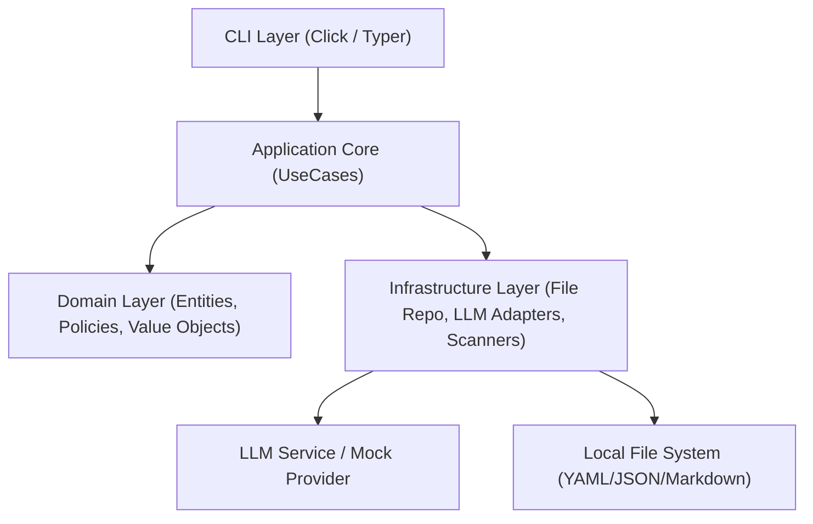

# DESIGN.md - needs-detector 詳細設計書

- 文書版: v0.1
- 作成日: 2026-08-05
- 著者/役割: Agent A (設計・審査担当)
- 状態: 010是正完了・審査PASS
- ベース仕様: `memo.md` (v0.1)

---

## 1. システム全体概要・アーキテクチャ

`needs-detector` は、仮説生成・検証・インタビュー記録・学びの反復を支援するPython製CLIツールである。
本設計では、`memo.md` で定義された 4ステップ（描く、探る、聴く、学ぶ）のワークフローおよび非機能要件を満たすレイヤード構造（Clean / Hexagonal Architecture 指向）を採用する。



### アーキテクチャ原則
1. **レイヤーの分離**: UI (CLI) はアプリケーションサービスを介してドメインロジックを呼び出す。ビジネスルールは外部 (LLM, FS) に依存しない。
2. **LLM依存の抽象化**: `LLMProvider` インターフェースを定義し、モック・手動プロンプト出力・実API (Gemini等) を差し替え可能にする。
3. **事実と推論・仮説の分離**: `Claim` / `Statement` オブジェクトには根拠種別 (`evidence`, `quote`, `hypothesis`, `inference`, `unknown`) を厳格に保持させる。

---

## 2. モジュール構成・パッケージ構造

```text
src/needs_detector/
├─ __init__.py
├─ cli/                     # CLIインターフェース
│  ├─ __init__.py
│  ├─ main.py               # エントリーポイント
│  └─ commands/             # CLIコマンド実装
│     ├─ project.py         # init, status
│     ├─ data.py            # add-idea, add-source, add-interview
│     ├─ workflow.py        # draw, explore, interview-guide, learn
│     └─ report.py          # report
├─ core/                    # アプリケーションサービス / ユースケース
│  ├─ __init__.py
│  ├─ project_service.py
│  ├─ draw_service.py
│  ├─ explore_service.py
│  ├─ interview_service.py
│  ├─ learn_service.py
│  └─ report_service.py
├─ domain/                  # ドメインモデル・ポリシー
│  ├─ __init__.py
│  ├─ models/
│  │  ├─ project.py         # Project, Idea, Source
│  │  ├─ persona.py         # Persona, Situation, Job
│  │  ├─ alternative.py     # Alternative, NonConsumption
│  │  ├─ interview.py       # InterviewRecord, Respondent, Question
│  │  └─ report.py          # CPFStatus, Report
│  └─ policies/
│     ├─ evidence.py        # 根拠評価ポリシー
│     ├─ cpf_evaluator.py   # CPF評価ロジック
│     └─ question_checker.py # 誘導質問検出ロジック
├─ infra/                   # インフラストラクチャ実装
│  ├─ __init__.py
│  ├─ repositories/         # ファイルシステム永続化
│  │  ├─ project_repo.py
│  │  └─ file_utils.py      # 安全なファイル操作 (アトミック書き込み)
│  ├─ llm/                  # LLMアダプター
│  │  ├─ base.py            # LLMProvider インターフェース
│  │  ├─ mock.py            # テスト用モックプロバイダー
│  │  ├─ manual.py          # 手動プロンプト出力プロバイダー
│  │  └─ gemini.py          # (v0.2以降) Gemini APIプロバイダー
│  └─ scanners/
│     └─ anonymizer.py      # 匿名化検出スキャナー
└─ utils/
   ├─ __init__.py
   ├─ logger.py             # 機密情報をマスクするロガー
   └─ audit.py              # 監査ログ (audit.jsonl)
```

---

## 3. データ構造とストレージ仕様

プロジェクトデータはローカルディスク上の特定ディレクトリ構成で管理する（NFR-001可読性、NFR-004秘密情報保護）。

### 3.1 プロジェクトディレクトリ構造
```text
<project-root>/
├─ project.yaml             # メタデータ・ステータス
├─ idea.md                  # 初期アイデア・仮説
├─ sources/                 # 入力一次資料
│  ├─ index.yaml            # 出典メタデータ (FR-004)
│  └─ <source-id>.md
├─ personas/                # 生成されたペルソナ・状況・ジョブ
│  └─ persona_<id>.yaml
├─ alternatives/            # 代替品・無消費分析
│  └─ alternatives.yaml
├─ interviews/              # インタビューガイドと取り込み記録
│  ├─ guide.md
│  └─ interview_<id>.yaml
├─ reports/                 # 生成レポート
│  └─ final_report.md
└─ audit.jsonl              # 実行履歴・承認ログ (FR-080)
```

### 3.2 主要スキーマ定義

#### `project.yaml`
```yaml
id: "proj_001"
name: "needs-detector"
created_at: "2026-08-05T12:00:00Z"
target_field: "新規事業開発"
status:
  step1_draw: "completed"     # unstarted | in_progress | waiting_human | completed
  step2_explore: "completed"
  step3_listen: "in_progress"
  step4_learn: "unstarted"
human_gate_enabled: true
```

#### `sources/index.yaml`
```yaml
sources:
  - id: "src_001"
    file_name: "market_research.md"
    registered_at: "2026-08-05T12:10:00Z"
    type: "markdown"
    origin: "社内調査資料"
    note: "競合分析のメモ"
```

#### `evidence` 情報メタデータ構造 (FR-005)
```python
class EvidenceType(Enum):
    EVIDENCE = "evidence"     # 入力資料/インタビューに直接根拠あり
    QUOTE = "quote"           # 顧客の直接発言
    HYPOTHESIS = "hypothesis" # 未検証仮説
    INFERENCE = "inference"   # 推論
    UNKNOWN = "unknown"       # 未確認

class Statement(BaseModel):
    text: str
    evidence_type: EvidenceType
    source_id: Optional[str] = None
    line_reference: Optional[str] = None  # 例: "interview_001:L15-L18"
```

---

## 4. コマンド仕様 (CLI Design)

`click` / `typer` を用いた標準的な CLI コマンド仕様。

| コマンド | オプション | 概要・振る舞い |
| :--- | :--- | :--- |
| `needs-detector init <name>` | `--dir <path>` | 指定ディレクトリにプロジェクト構成と `project.yaml` を生成 (FR-001) |
| `needs-detector add-idea <file>` | `--force` | 初期アイデア・仮説ファイルを登録 (FR-002) |
| `needs-detector add-source <file>` | `--type`, `--origin`, `--note` | 一次資料を取り込み `sources/index.yaml` を更新 (FR-003, FR-004) |
| `needs-detector draw` | `--provider <mock\|manual>`, `--persona-count N` | Step 1 実行: ペルソナ・状況・ジョブ生成 (FR-010~FR-015) |
| `needs-detector explore` | `--provider <mock\|manual>` | Step 2 実行: 直接競合・間接代替・無消費の整理 (FR-020~FR-024) |
| `needs-detector interview-guide`| `--output <file>` | Step 3 質問案と冒頭文を生成、誘導質問判定 (FR-030~FR-032) |
| `needs-detector add-interview <file>` | `--respondent-id`, `--anonymize-check` | インタビュー記録登録、個人情報候補スキャン (FR-033, FR-034) |
| `needs-detector learn` | `--provider <mock\|manual>` | Step 4 実行: 回答者分類・反証抽出・ペルソナ/ジョブ更新・CPF評価 (FR-040~FR-046) |
| `needs-detector report` | `--output <file>` | 最終 Markdown レポートを出力 (FR-050) |
| `needs-detector status` | - | 各ステップの進捗状態と人間確認ゲート待ちを表示 (FR-060, FR-061) |

---

## 5. ドメインロジック & ポリシー詳細設計

### 5.1 人間確認ゲート (Human Gate Policy) (FR-061)
- `project.yaml` 内の `human_gate_enabled` が `true` の場合、前ステップが `completed` でない場合は次ステップのコマンド実行を停止する。
- **Step 3 完了判定ルール**: `interviews/` 内に `interview_*.yaml` が1件も登録されていない場合、Step 3 を `completed` に変更することはできず、エラーメッセージを出力する (AC-003, AC-012)。

### 5.2 誘導質問検出ポリシー (FR-031, AC-006)
- 正規表現パターンおよびキーワードマッチングルールを定義：
  - パターン1: 未開拓の未来行動確認 ("使いますか", "購入しますか", "利用したいですか")
  - パターン2: 機能への受動的好感 ("機能があれば欲しいですか", "便利だと思いますか")
  - パターン3: 誘導的不満提示 ("〜に困っていませんか", "〜は不便ですよね")
- 検出時は、警告理由と推奨修正案 (例: 「直近で〜した具体的な経験を教えてください」) を出力する。

### 5.3 反証抽出 & 引用追跡ポリシー (FR-041, FR-042, AC-007)
- インタビュー記録テキストをパースする際、仮説 (`hypotheses`) と照合し、否定・齟齬を示すキーワード（「使わなかった」「不要」「別のやり方」「面倒でやめた」「効果がなかった」等）を含む発言を `refutations` (反証) として分類。
- レポート生成時は反証セクションを最上位付近に配置し、必ず `[interview_001.md:L42]` 形式の出典タグを付与する。

### 5.4 CPF (Customer Problem Fit) 評価ロジック (FR-045, AC-008)
以下の3基準についてスコア判定 (`未確認`, `弱い`, `一部確認`, `強い`) を行う：
1. **実在する課題**: 具体的なエピソード・頻度の語られた割合
2. **最初に動く人**: 既に独自に時間・費用・代替品を投入している顧客の有無
3. **現在の代替品**: 代替品の特定と具体的不満の存在
- *ルール*: インタビュー件数 0 の場合は強制的に全項目 `未確認` とし、仮説段階であることを明示する。

---

## 6. LLM抽象化とプロンプト管理 (FR-070, NFR-005)

### 6.1 `LLMProvider` インターフェース
```python
class LLMResponse(BaseModel):
    content: str
    ai_completions: List[str]  # 資料になくAIが補完した事項の一覧 (FR-015)
    prompt_used: str
    model_name: str

class LLMProvider(ABC):
    @abstractmethod
    def generate(self, prompt_name: str, context: Dict[str, Any]) -> LLMResponse:
        pass
```

### 6.2 セキュリティ対策 (NFR-005 プロンプトインジェクション)
- 入力資料（`sources/*.md` や `interviews/*.md`）は、プロンプトテンプレート挿入時にデリミタ (`<user_data> ... </user_data>`) で明確にエスケープ・隔離し、システム命令として扱わない指示プロンプトを前置する。

---

## 7. 要件トレースビリティ（要件 vs 設計マップ）

| 要件ID | 設計コンポーネント / モジュール | 対応仕様・ファイル |
| :--- | :--- | :--- |
| **FR-001** ~ **FR-005** | `cli/commands/project.py`, `data.py`, `infra/repositories/project_repo.py` | プロジェクト初期化、アイデア/資料登録、`sources/index.yaml` の根拠タグ管理 |
| **FR-010** ~ **FR-015** | `core/draw_service.py`, `domain/models/persona.py` | ペルソナ・状況・ジョブ生成、AI補完事項の明示抽出 |
| **FR-020** ~ **FR-024** | `core/explore_service.py`, `domain/models/alternative.py` | 3方向代替品分類、比較テーブルデータ構造、無消費要因分析 |
| **FR-030** ~ **FR-034** | `core/interview_service.py`, `domain/policies/question_checker.py`, `infra/scanners/anonymizer.py` | ガイド生成、誘導質問パターン警告、個人情報候補検出スキャン |
| **FR-040** ~ **FR-046** | `core/learn_service.py`, `domain/policies/cpf_evaluator.py` | 回答者3分類、反証優先抽出、ペルソナ/ジョブ書き換え、4段階CPF評価 |
| **FR-050** | `core/report_service.py` | レポート統合生成 (Markdown) |
| **FR-060**, **FR-061** | `domain/policies/human_gate.py`, `cli/commands/workflow.py` | ステータス管理、Step 3 未実施の進行ブロック |
| **FR-070**, **FR-071** | `infra/llm/` (`base.py`, `mock.py`, `manual.py`) | オフラインテスト対応LLMプロバイダー分離 |
| **FR-080** | `utils/audit.py` | `audit.jsonl` へのコマンド実行・承認ログ記録 |
| **NFR-004** | `.gitignore`, `infra/scanners/anonymizer.py` | 秘密情報・APIキー・顧客データのコミット防止 |
| **NFR-006** | `infra/repositories/file_utils.py` | パス検証、原子的一時ファイル書き込み (`atomic_write`) |

---

## 8. 成果物フォーマット選定方針 (YAML, JSON, Markdown)

| 形式 | 主な用途 | 選定理由 |
| :--- | :--- | :--- |
| **YAML** | 設定ファイル (`project.yaml`)、構造化モデル (`personas/*.yaml`, `alternatives.yaml`, `interviews/*.yaml`) | 人間が直接エディタで閲覧・編集しやすく、コメントが保存できるため。 |
| **JSON / JSONL** | 実行・監査ログ (`audit.jsonl`) | 機械可読性が高く、追記 (append-only) が容易で構造化ログのパースに適しているため。 |
| **Markdown** | 入力アイデア (`idea.md`)、一次資料 (`sources/*.md`)、最終成果物 (`reports/final_report.md`) | ドキュメントとしての読みやすさ、プレーンテキストの移植性、レポート表示への適正のため。 |

---

## 9. 4ステップ（描く・探る・聴く・学ぶ）の処理設計詳細

### Step 1: 描く (Draw)
- **入力**: `idea.md`, `sources/*.md`
- **処理**:
  1. 一次資料とアイデアをデリミタ付きプロンプトに組み込み、`LLMProvider` を呼び出す。
  2. ペルソナ候補・関連状況・ジョブ仮説・阻むもの・代替手段仮説を抽出。
  3. AIが資料外から補完した事項を `ai_completions` として識別・記録 (FR-015)。
- **出力**: `personas/persona_<id>.yaml`

### Step 2: 探る (Explore)
- **入力**: `personas/*.yaml`
- **処理**:
  1. 対象ジョブに対し、直接競合・間接代替・無消費の3方向から代替手段を収集・分類。
  2. 費用、所要時間、手間、利点、不満、継続理由を比較構造化。
  3. 最も強い代替品および無消費要因（アクセス・費用・時間・組織制約等）を特定。
- **出力**: `alternatives/alternatives.yaml`

### Step 3: 聴く (Listen)
- **入力**: `personas/*.yaml`, `alternatives/alternatives.yaml`
- **処理**:
  1. 30分程度のインタビュー質問案（基本5質問＋深掘り質問）および冒頭文（感謝、目的、匿名化、録音許可）を生成。
  2. `QuestionChecker` により誘導質問パターンを検証・警告提示 (FR-031)。
  3. 利用者が匿名化インタビュー記録を追加する際、個人情報候補をスキャン (FR-034)。
- **出力**: `interviews/guide.md`, `interviews/interview_<id>.yaml`

### Step 4: 学ぶ (Learn)
- **入力**: `interviews/interview_*.yaml`, `personas/*.yaml`
- **処理**:
  1. 回答者を具体性に基づき3分類（強く反応した人 / 関心はあるが動いていない人 / 課題を持っていない人）。
  2. 当初仮説と矛盾する発言・反証を優先抽出 (`refutations`)。
  3. CPF (Customer Problem Fit) 評価判定（実在課題、最初に動く人、現在の代替品）を4段階で実施。
- **出力**: `reports/final_report.md`

---

## 10. 安全性・品質・入力検証方針

### 10.1 入力検証とエラー処理
- CLI入力パスの検証: `Path.resolve()` を使用し、プロジェクトルート外へのアクセスやパストラバーサルを遮断。
- 存在しないファイル指定時の `FileNotFoundError` のトラップと分かりやすいエラー表示。
- ファイル変更のアトミック性: `file_utils.py` の `atomic_write` により、一時ファイル (`.tmp`) 作成後に置換。

### 10.2 個人情報、匿名化、ログ方針 (NFR-004, NFR-008)
- ログ出力時は正規表現で API キーや個人情報パターン（メールアドレス、電話番号等）をマスク。
- 匿名化候補スキャンは、依存追加なしの保守的な規則を使い、会社名は株式会社・有限会社・合同会社の法的種別が明示された表記を初期対象とする。ASCII・全角英数字、漢字、ひらがな、カタカナ、中黒、アンパサンド、ピリオドと法的種別間の空白を扱う。
- 会社名候補では既知の文脈接頭語と支店等の組織単位を除外する。全漢字の商号と拠点名の境界など、安全に分離できない表記は過剰な部分候補を返さない。候補はNERによる確定結果ではなく、人間の最終確認を必要とする。
- 実顧客データおよび `.env` は `.gitignore` に登録し、リポジトリに追跡させない。

### 10.3 テスト可能性を高める設計
- 全外部依存 (ファイルIO, CLI表示, LLM呼び出し) はインターフェース・依存性注入 (DI) を経由。
- ドメインポリシー (`cpf_evaluator.py`, `question_checker.py`) は標準Pythonクラスとして純粋関数的にテスト可能。

---

## 11. 未決事項 (decisions.md へ記録予定)
- CLIフレームワークの選定 (`click` vs `typer`)
- プロンプトテンプレートのバージョン管理方法
- 匿名化検出用正規表現ルールの拡充方針

---

## 12. MVP対象外機能
- AI単独による市場成立断定
- 自動営業・自動インタビュー機能
- 音声ファイルの直接解析 (テキスト化済みファイルのみ対象)
- Web UI / GUI (初期版はCLIのみ)

---

## 13. デュアルエージェント運用規則

本設計書に基づく実装は **Agent B (実装・テスト担当)** が担当する。
- **Agent A**: 本設計書 `DESIGN.md` および `TESTPLAN.md` の作成・修正、および Agent B が作成した PR/差分のレビュー。
- **Agent B**: 承認された `DESIGN.md` に基づき `src/` および `tests/` をコード実装。
- **成果物記録**: `records/agent-a-design.md`, `records/agent-b-implementation.md`, `records/agent-a-review.md` に記録を残す。

